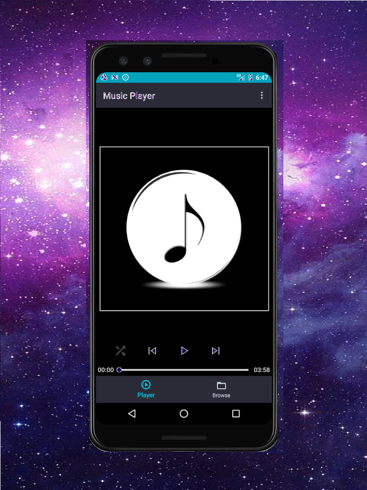

<!--  -->

 <!--  -->

<table>
  <tr>
        <td align="center">
        
        </td>
        <td>
        
        </td>
        <td>
        
        </td>
  </tr>
  <tr>
        <td>
        
        </td>
        <td>
        
        </td>
        <td>
        
        </td>
  </tr>
</table>

*Google closed my account on the play store b/c I was inactive*

---
### About   
- **World's best** Music Player app for playing local audio files.   
- ---Found at Google Play Store: [Brodski Minimalist Music Player with Swipe & Touch](https://play.google.com/store/apps/details?id=com.bskimusicplayer.mediaplayer)--- removed b/c google 
- Selling point? Minimalist, no ads, very responsive. When you tap to pause it will pause (great for when you're driving). 
  
  
### Tech Specs: 
- The player itself uses the ExoPlayer media player ([github link](https://github.com/google/ExoPlayer)), an alternative to the out-of-the-box media controls that comes with the Android Framework.  
- Follows the 'single-activity multiple-fragments' architecture pattern.  
- Uses a foreground service to play audio  
- Registered to receive implicit intents for audio  
- Supports gestures  
- Data persistence for user preferences  
- And broadcasts intents for email (to email me about stuff)  
  